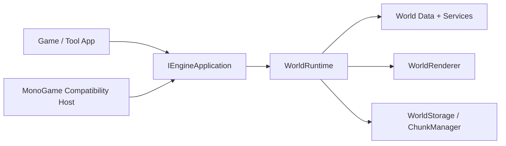

# TileWorld Engine

`TileWorld.Engine` is a chunked 2D tile-world engine aimed at Terraria-like games.

The current repository contains the first major milestone of the project: a working engine core that can:

- create and persist chunked tile worlds,
- query and edit tiles through a single runtime facade,
- rebuild render caches for dirty chunks,
- run through an engine-owned application lifecycle,
- host a desktop smoke-test game without letting the application project depend on MonoGame directly.

## Design Philosophy

Unity is commonly understood through a `GameObject / Component / ECS-oriented` mental model.

`TileWorld.Engine` uses a different center of gravity:

- `Tile-first`: the tile cell is the smallest interactive world unit.
- `Chunk-first`: the chunk is the smallest unit of loading, saving, dirty tracking, and render caching.
- `Facade-first`: gameplay and tools should prefer `WorldRuntime` instead of wiring low-level services together manually.
- `Backend-decoupled`: the core engine should not expose MonoGame types. Rendering and host lifecycle integration live behind compatibility layers.
- `Explicit data flow`: world data, editing, autotile refresh, dirty propagation, render cache rebuilding, and storage are separate systems with clear boundaries.

In short, this engine is not being built as a general-purpose scene graph engine. It is being built as a specialized tile-world runtime where chunked terrain data is the primary architectural axis.

## What Exists Today

Phase 1 is functionally complete.

Implemented areas:

- Core math and diagnostics primitives
- World metadata, chunk containers, coordinate conversion, and tile cell storage
- Content registry and tile definitions
- Query and edit pipeline with dirty propagation
- Minimal autotile system
- Chunk render cache builder and world renderer
- Persistent `world.json` + binary chunk storage
- Auto-save and shutdown-save behavior
- Engine-owned application lifecycle abstraction
- MonoGame compatibility host in a separate project
- Desktop smoke-test application with debug overlay and interactive tile editing

## Solution Layout

- `TileWorld.Engine`
  - The engine core: world data, runtime, rendering abstractions, persistence, diagnostics, input abstractions.
- `TileWorld.Engine.Hosting.MonoGame`
  - A compatibility host that owns the MonoGame lifecycle and render submission.
  - This is currently the only project that directly references MonoGame.
- `TileWorld.Testing.Desktop`
  - A small test application built on `IEngineApplication`.
  - It does not directly reference MonoGame.
- `TileWorld.Engine.Tests`
  - Automated tests for engine behavior and architecture guards.

## Runtime Shape

The intended layering is:



Important consequence:

- external game code should primarily talk to `WorldRuntime`,
- host-specific lifecycle code should live in compatibility layers,
- low-level engine plumbing is intentionally kept internal where possible.

## Rendering Approach

The engine does not submit MonoGame draw calls directly.

Instead:

1. `TileWorld.Engine` builds backend-neutral draw commands,
2. `WorldRenderer` caches chunk draw data,
3. the compatibility host converts those commands into actual backend calls.

This keeps the gameplay/runtime side independent from MonoGame-specific types and makes it easier to replace the backend later.

## Persistence Approach

The current storage format uses:

- `world.json` for world metadata,
- `chunks/{x}_{y}.chk` for binary chunk payloads.

The runtime currently supports:

- manual save,
- shutdown save,
- periodic auto-save,
- idle-triggered auto-save.

The goal is to reduce world-loss risk if the game exits unexpectedly, while keeping storage flow explicit and easy to reason about.

## Desktop Smoke Test

`TileWorld.Testing.Desktop` is the current manual verification shell.

Controls:

- Left mouse: place selected tile
- Right mouse: break tile
- `1 / 2 / 3`: switch selected tile
- `F1`: toggle debug overlay
- `F5`: manual save
- `WASD` or arrow keys: move camera
- `Shift`: camera speed boost

The overlay shows:

- visible chunk boundaries,
- save-dirty chunk markers,
- hovered tile highlight,
- tile/chunk/local coordinates,
- tile ID, variant, flags, dirty flags,
- current selection, camera position, persistence mode.

## Build, Test, Run

Build the whole solution:

```powershell
dotnet build TileWorldEngine.sln
```

Run tests:

```powershell
dotnet test TileWorldEngine.sln --no-build
```

Run the desktop smoke app:

```powershell
dotnet run --project TileWorld.Testing.Desktop
```

## Current Boundary Rules

These rules are intentional and important:

- `TileWorld.Engine` should not expose MonoGame types.
- `TileWorld.Testing.Desktop` should not directly depend on MonoGame.
- MonoGame ownership currently lives in `TileWorld.Engine.Hosting.MonoGame`.
- External callers should prefer `WorldRuntime` over lower-level runtime infrastructure.

This keeps the project aligned with the long-term goal: the engine owns the gameplay lifecycle, while graphics/input hosts remain swappable adapters.
