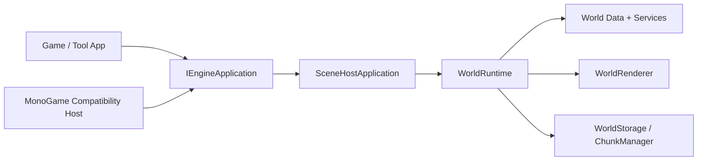

# TileWorld Engine

[English](README.md) | [Simplified Chinese](README.zh-CN.md)

`TileWorld.Engine` is a chunk-first 2D tile-world engine aimed at Terraria-like sandbox games.

The repository is no longer at a "phase one only" state. It now includes:

- a stable world runtime facade,
- chunked world persistence,
- dirty tracking and autotile refresh,
- background wall, object, player, and drop prototypes,
- a backend-neutral render command pipeline,
- a MonoGame compatibility host that keeps MonoGame out of the game application project,
- a Desktop sandbox shell with world selection, in-world interaction, and debug tooling,
- the first slice of phase 4: procedural world generation, biome queries, chunk source tracking, streaming foundations, and single-channel runtime lighting.

## Design Philosophy

Unity is commonly understood through a `GameObject / Component / ECS-oriented` mental model.

`TileWorld.Engine` uses a different center of gravity:

- `Tile-first`: the tile cell is the smallest interactive world unit.
- `Chunk-first`: the chunk is the smallest unit of loading, saving, dirty tracking, and render caching.
- `Facade-first`: gameplay and tools should prefer `WorldRuntime` instead of wiring low-level services together manually.
- `Backend-decoupled`: the core engine should not expose MonoGame types. Rendering and host lifecycle integration live behind compatibility layers.
- `Explicit data flow`: world data, editing, autotile refresh, dirty propagation, render cache rebuilding, storage, object occupancy, and entity simulation are separate systems with clear boundaries.

This is not being built as a general-purpose scene graph engine. It is being built as a specialized tile-world runtime whose primary architectural axis is chunked terrain data.

## What Exists Today

Implemented areas include:

- core math, diagnostics, input, and hosting abstractions,
- world metadata, chunk containers, coordinate conversion, and tile cell storage,
- tile, wall, object, item, and biome registries,
- query/edit pipelines with dirty propagation and autotile refresh,
- chunk render cache building and backend-neutral world rendering,
- binary chunk persistence plus separate persisted player/runtime-entity data,
- active chunk management, unload flow, and background outer-ring chunk prefetch,
- static objects with occupancy, support checks, and persistence,
- basic entity simulation, player movement, drops, and tile collision,
- generator-driven world bootstrap with biome lookup,
- derived single-channel runtime lighting for sky light and emissive sources,
- a Desktop sandbox shell with world selection, pause overlay, debug overlay, and save/load validation paths.

## Solution Layout

- `TileWorld.Engine`
  - The core engine: world data, runtime, content registries, rendering abstractions, storage, diagnostics, and input abstractions.
- `TileWorld.Engine.Hosting.MonoGame`
  - A compatibility host that owns the MonoGame lifecycle and render submission.
  - This is currently the only project that directly references MonoGame.
- `TileWorld.Testing.Desktop`
  - A Desktop sandbox application built on engine hosting abstractions.
  - It does not directly reference MonoGame.
- `TileWorld.Engine.Tests`
  - Automated tests for engine behavior, persistence, generation, and architecture guards.

## Runtime Shape

The intended layering is:



Important consequence:

- external game code should primarily talk to `WorldRuntime`,
- host-specific lifecycle code should live in compatibility layers,
- lower-level runtime plumbing is intentionally kept internal where possible.

## Rendering Approach

The engine does not submit MonoGame draw calls directly.

Instead:

1. `TileWorld.Engine` builds backend-neutral draw commands,
2. `WorldRenderer` caches chunk draw data,
3. the compatibility host converts those commands into actual backend calls.

This keeps the gameplay/runtime side independent from MonoGame-specific types and makes it easier to replace the backend later.

## Persistence Approach

The current save layout uses:

- `world.json` for world metadata,
- `chunks/{x}_{y}.chk` for binary chunk payloads,
- `playerdata/players.json` for persisted player state,
- `entities/entities.bin` for persisted non-player runtime entities.

The runtime currently supports:

- manual save,
- shutdown save,
- periodic auto-save,
- idle-triggered auto-save.

Generated chunks are marked save-dirty on first access so visited terrain becomes stable world state instead of being regenerated indefinitely.

## Desktop Sandbox

`TileWorld.Testing.Desktop` is the current manual verification shell.

It now includes:

- world selection,
- create-world flow,
- generator-backed world startup,
- tile / wall / object editing,
- player movement and drop collection,
- pause overlay with continue / return-to-menu flow,
- debug overlay with chunk, tile, object, dirty-state, and biome details.

## Build, Test, Run

Build the whole solution:

```powershell
dotnet build TileWorldEngine.sln
```

Run tests:

```powershell
dotnet test TileWorldEngine.sln --no-build
```

Run the Desktop sandbox:

```powershell
dotnet run --project TileWorld.Testing.Desktop
```

## Current Boundary Rules

These rules are intentional and important:

- `TileWorld.Engine` should not expose MonoGame types.
- `TileWorld.Testing.Desktop` should not directly depend on MonoGame.
- MonoGame ownership currently lives in `TileWorld.Engine.Hosting.MonoGame`.
- External callers should prefer `WorldRuntime` over lower-level runtime infrastructure.

This keeps the project aligned with the long-term goal: the engine owns the gameplay lifecycle, while graphics/input hosts remain swappable adapters.
