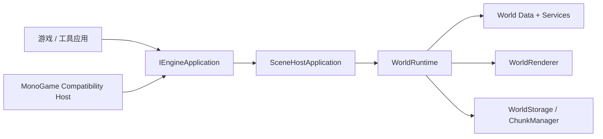

# TileWorld Engine

[English](README.md) | [简体中文](README.zh-CN.md)

`TileWorld.Engine` 是一个以分块 Tile 世界为核心、面向 Terraria-like 沙盒游戏的 2D 引擎。

当前仓库已经不再停留在“只完成第一阶段”的状态。现在它已经具备：

- 稳定的世界运行时门面，
- 分块世界持久化，
- 脏标记传播与 AutoTile 刷新，
- 背景墙、对象、玩家、掉落物等原型系统，
- 与渲染后端解耦的绘制命令管线，
- 将 MonoGame 留在兼容宿主层的启动方案，
- 带存档选择、世界内交互和调试工具的 Desktop 沙盒壳，
- 第四阶段起步能力：程序化世界生成、群系查询、Chunk 来源跟踪、流式加载基础。

## 设计理念

Unity 常常会以 `GameObject / Component / ECS-oriented` 的思维方式来理解。

`TileWorld.Engine` 的中心则不同：

- `Tile-first`：Tile Cell 是最小交互单元。
- `Chunk-first`：Chunk 是最小的加载、保存、脏标记和渲染缓存单元。
- `Facade-first`：游戏逻辑与工具层应优先通过 `WorldRuntime` 使用引擎，而不是直接拼接底层服务。
- `Backend-decoupled`：核心引擎不暴露 MonoGame 类型。渲染与宿主生命周期放在兼容层中。
- `Explicit data flow`：世界数据、编辑、AutoTile、脏传播、渲染缓存、对象占位、实体模拟、存储流程都保持明确边界。

这个项目不是在做一个“通用场景图引擎”，而是在做一个“以 Chunk 化地形世界为主轴”的专用运行时。

## 当前已实现内容

目前已经落地的能力包括：

- Core Math、Diagnostics、Input、Hosting 抽象
- 世界元数据、Chunk 容器、坐标换算、Tile Cell 存储
- Tile / Wall / Object / Item / Biome 内容注册
- 查询 / 编辑链路、脏标记传播、AutoTile
- Chunk 渲染缓存构建与后端无关的世界渲染
- 二进制 Chunk 持久化，以及独立的玩家 / 运行时实体存档
- Active Chunk 管理、卸载流程、外围 Chunk 后台预取
- 静态对象占位、支撑规则与对象持久化
- 基础实体模拟、玩家移动、掉落物与 Tile 碰撞
- 基于生成器的新世界初始化与群系查询
- 带世界选择、暂停蒙层、调试覆盖层、存读档验证链路的 Desktop 沙盒壳

## 解决方案结构

- `TileWorld.Engine`
  - 引擎核心：世界数据、运行时、内容注册、渲染抽象、存储、诊断、输入抽象。
- `TileWorld.Engine.Hosting.MonoGame`
  - MonoGame 兼容宿主，负责生命周期和渲染提交。
  - 当前这是唯一直接引用 MonoGame 的项目。
- `TileWorld.Testing.Desktop`
  - 基于引擎宿主抽象的 Desktop 沙盒应用。
  - 它本身不直接引用 MonoGame。
- `TileWorld.Engine.Tests`
  - 用于验证引擎行为、持久化、生成逻辑和架构护栏的自动化测试。

## 运行时结构

推荐层次关系如下：



这意味着：

- 外部游戏代码应优先通过 `WorldRuntime` 与世界交互，
- 宿主相关的生命周期代码应放在兼容层，
- 底层运行时基础设施尽量保持内部可替换，不暴露给外部调用方。

## 渲染方案

引擎核心不会直接提交 MonoGame 绘制调用。

当前路径是：

1. `TileWorld.Engine` 生成后端无关的绘制命令，
2. `WorldRenderer` 构建和维护 Chunk 级渲染缓存，
3. 兼容宿主把这些命令转换成实际后端调用。

这样可以让玩法运行时与 MonoGame 类型解耦，也让后续替换渲染后端更容易。

## 存储方案

当前存档布局为：

- `world.json`：世界元数据
- `chunks/{x}_{y}.chk`：二进制 Chunk 数据
- `playerdata/players.json`：玩家持久化状态
- `entities/entities.bin`：非玩家运行时实体持久化状态

当前运行时已经支持：

- 手动保存，
- 关闭时保存，
- 固定周期自动保存，
- 编辑后静置触发的自动保存。

另外，生成出来并首次访问的 Chunk 会立即标记为 `SaveDirty`，确保玩家访问过的世界区域会变成稳定世界状态，而不是每次都重新生成。

## Desktop 沙盒

`TileWorld.Testing.Desktop` 是当前阶段的人工作验壳。

它现在具备：

- 存档选择，
- 新建世界流程，
- 基于生成器的新世界启动，
- Tile / Wall / Object 编辑，
- 玩家移动与掉落拾取，
- 暂停蒙层与“继续游戏 / 返回菜单”流程，
- 带 Chunk、Tile、对象、脏状态、Biome 信息的调试覆盖层。

## 构建、测试、运行

构建整个解决方案：

```powershell
dotnet build TileWorldEngine.sln
```

运行测试：

```powershell
dotnet test TileWorldEngine.sln --no-build
```

运行 Desktop 沙盒：

```powershell
dotnet run --project TileWorld.Testing.Desktop
```

## 当前边界约束

下面这些约束是当前架构设计里的重要前提：

- `TileWorld.Engine` 不暴露 MonoGame 类型。
- `TileWorld.Testing.Desktop` 不直接依赖 MonoGame。
- MonoGame 的生命周期 ownership 当前集中在 `TileWorld.Engine.Hosting.MonoGame`。
- 外部调用方应优先使用 `WorldRuntime`，而不是直接依赖底层运行时基础设施。

这样可以保证项目继续朝长期目标演进：由引擎自身负责游戏生命周期，而图形 / 输入后端只是可替换的宿主适配层。
