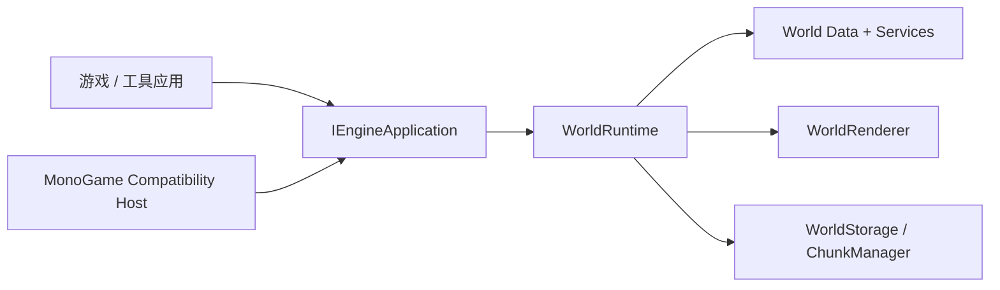

# TileWorld Engine

`TileWorld.Engine` 是一个面向类泰拉瑞亚游戏的分块 2D Tile World Engine。

当前仓库已经完成项目第一阶段的大里程碑：一个可工作的引擎核心，已经能够：

- 创建并持久化分块 Tile 世界；
- 通过统一的运行时门面对 Tile 进行查询与修改；
- 对脏 Chunk 重建渲染缓存；
- 通过引擎自有的应用生命周期接口驱动运行；
- 在不让应用项目直接依赖 MonoGame 的前提下，启动一个桌面测试游戏。

## 设计理念

Unity 通常会以 `GameObject / Component / ECS-oriented` 这样的心智模型来理解。

`TileWorld.Engine` 的架构重心并不一样：

- `Tile-first`：Tile Cell 是最小的交互世界单元；
- `Chunk-first`：Chunk 是最小的加载、保存、脏标记和渲染缓存单元；
- `Facade-first`：游戏逻辑和工具层应优先通过 `WorldRuntime` 访问世界，而不是手动拼装底层服务；
- `Backend-decoupled`：核心引擎不暴露 MonoGame 类型；渲染与宿主生命周期集成放在兼容层中；
- `Explicit data flow`：世界数据、编辑、自动连接、脏传播、渲染缓存重建、存储都是边界清晰的独立系统。

换句话说，这个项目并不是在做一个“通用场景图引擎”，而是在做一个“以分块地形世界为架构主轴”的专用运行时。

## 当前已实现内容

第一阶段已经在功能上闭环。

当前已完成的模块包括：

- Core Math 与 Diagnostics 基础设施
- 世界元数据、Chunk 容器、坐标转换、Tile Cell 存储
- Content Registry 与 Tile Definition
- 查询 / 编辑链路与 Chunk 脏标记传播
- 最小 AutoTile 系统
- Chunk Render Cache Builder 与 World Renderer
- `world.json` + 二进制 Chunk 的持久化
- 自动保存与关闭保存
- 引擎自有的应用生命周期抽象
- 独立的 MonoGame 兼容宿主项目
- 带调试覆盖层和交互编辑能力的 Desktop 测试应用

## 解决方案结构

- `TileWorld.Engine`
  - 引擎核心：世界数据、运行时、渲染抽象、存储、诊断、输入抽象。
- `TileWorld.Engine.Hosting.MonoGame`
  - MonoGame 兼容宿主，负责生命周期和渲染提交。
  - 当前这是唯一直接引用 MonoGame 的项目。
- `TileWorld.Testing.Desktop`
  - 基于 `IEngineApplication` 的桌面测试应用。
  - 它本身不直接引用 MonoGame。
- `TileWorld.Engine.Tests`
  - 引擎行为测试与架构护栏测试。

## 运行时结构

推荐的层次关系如下：



这意味着：

- 外部游戏代码应主要与 `WorldRuntime` 交互；
- 宿主相关的生命周期代码应放在兼容层；
- 底层运行时基础设施不应成为外部代码的默认依赖目标。

## 渲染方案

引擎核心不会直接提交 MonoGame 的绘制调用。

当前路径是：

1. `TileWorld.Engine` 生成与后端无关的绘制命令；
2. `WorldRenderer` 维护并复用 Chunk 级渲染缓存；
3. 宿主兼容层把这些命令转换成实际后端调用。

这样做的好处是：玩法运行时与 MonoGame 类型解耦，后续替换渲染后端时也更容易迁移。

## 存储方案

当前存档格式为：

- `world.json`：保存世界元数据；
- `chunks/{x}_{y}.chk`：保存二进制 Chunk 数据。

当前运行时已经支持：

- 手动保存；
- 关闭时保存；
- 固定周期自动保存；
- 编辑后静置一段时间的自动保存。

目标是尽量降低异常退出导致世界数据全部丢失的风险，同时保持存储行为清晰、可控。

## Desktop 测试应用

`TileWorld.Testing.Desktop` 是当前阶段的人工验证壳。

操作方式：

- 鼠标左键：放置当前选中 Tile
- 鼠标右键：破坏 Tile
- `1 / 2 / 3`：切换当前 Tile
- `F1`：开关调试覆盖层
- `F5`：手动保存
- `WASD` 或方向键：移动相机
- `Shift`：相机加速

调试覆盖层会显示：

- 可见 Chunk 边界；
- 需要保存的 Chunk 标记；
- 鼠标悬停 Tile 高亮；
- Tile / Chunk / Local 坐标；
- Tile ID、Variant、Flags、DirtyFlags；
- 当前选中 Tile、相机位置、持久化状态。

## 构建、测试、运行

构建整个解决方案：

```powershell
dotnet build TileWorldEngine.sln
```

运行测试：

```powershell
dotnet test TileWorldEngine.sln --no-build
```

运行桌面测试应用：

```powershell
dotnet run --project TileWorld.Testing.Desktop
```

## 当前边界约束

以下约束是当前架构设计中的重要前提：

- `TileWorld.Engine` 不应暴露 MonoGame 类型；
- `TileWorld.Testing.Desktop` 不应直接依赖 MonoGame；
- MonoGame 生命周期 ownership 当前集中在 `TileWorld.Engine.Hosting.MonoGame`；
- 外部调用方应优先使用 `WorldRuntime`，而不是直接依赖底层运行时基础设施。

这样可以保证项目继续朝长期目标演进：由引擎自身负责游戏生命周期，而图形 / 输入后端仅作为可替换的适配层存在。
